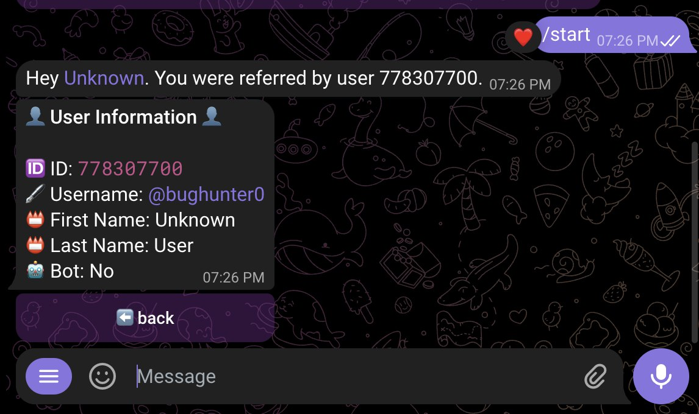

# Referral-Bot
 This bot serves as a demonstration of referral system implementation on the Telegram platform using the Pyrogram library in Python.
 
# Bot Features:

1. **Referral System:** Users can start the bot with a referral code appended to the start command. When a user is referred, the bot acknowledges the referrer and provides them with an option to view the referred user's information.
2. **Invite Link Generation:** Users can generate invite links with their unique IDs appended, allowing them to refer others to the bot.
3. **User Information Display:** Referrers can view basic information about the users they've referred, including their username, first name, last name, phone number (if available), and whether they are a bot or not.

## Screenshots

   
  
  
  

Do follow for [more](https://github.com/nuhmanpk) 
